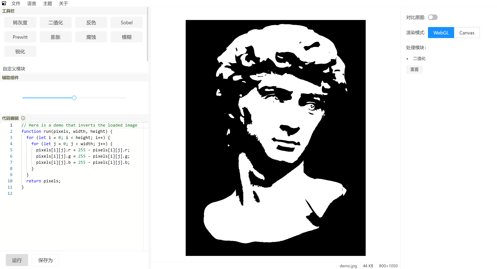

# web-image-processing

一个使用 React 构建的简单 Web 图像处理工具。内置了一些使用 WebGL 实现的图像处理算法，同时允许用户通过编写 JavaScript 实现基于 Canvas
API 的自定义处理算法。

[Online Page](https://web-image-processing.vercel.app)



## 运行

```shell
npm install
npm run dev
```
